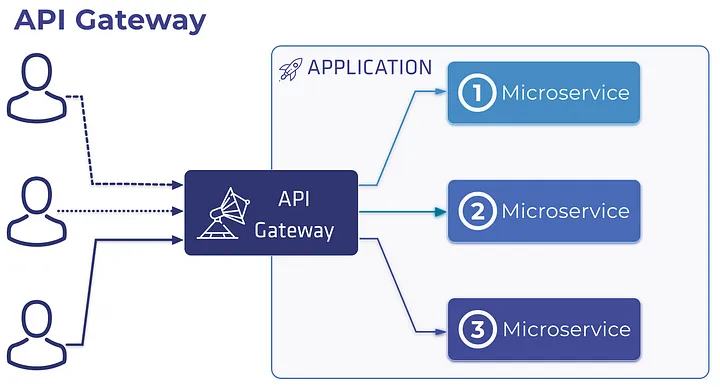

API Gateway is a tool that receives requests from the client to different services from a single entry point and directs them to the relevant service.

Authentication and authorization operations are also carried out in this layer.

I did not create a token generation service in the application. You can generate the appropriate token according to your own configuration settings from the following website : <a href="http://jwtbuilder.jamiekurtz.com/" target="_blank">Token Create</a>

If you want to create a jwt configuration from start to finish, you can check out the relevant repo: <a href="https://github.com/enesaktas10/JWT-Authentication-Asp.Net-Core" target="_blank">JWT Repo</a>

